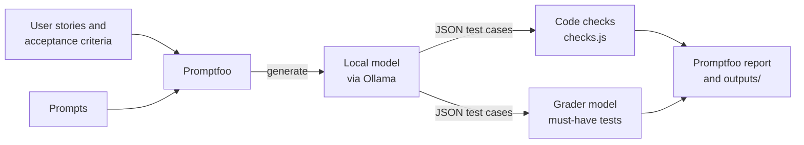

# ai-js-promptfoo-eval

Evaluates LLM output with [Promptfoo](https://www.promptfoo.dev) and local models through [Ollama](https://ollama.com): test cases a model writes from user stories, and translation quality. No API keys needed.

[](https://github.com/yashwant-das/ai-js-promptfoo-eval/actions/workflows/tests.yml)
[](LICENSE)
[](https://www.promptfoo.dev)
[](https://ollama.com)
[](https://nodejs.org)

## Why it exists

"The model writes good test cases" is a claim that needs evidence. This repo grades model output the way a QA lead would: deterministic code checks set a floor, and a grader model checks each story for the specific tests an experienced engineer would expect. Two suites:

- **Test design**: a model writes test cases from a user story, and the suite grades them.
- **Translation**: translation quality across prompts, including idioms, code, numbers and scripts.

## Architecture



Each model output goes through both layers: code checks with no model involved, then a grader model that looks for each must-have test separately.

## Quickstart

Prerequisites:

- [Node.js](https://nodejs.org) 22.22 or later
- [Ollama](https://ollama.com) running locally with the tested models pulled:

  ```bash
  ollama pull qwen3.8:27b-mlx
  ollama pull qwen3.6:35b-mlx   # second model for the test-design comparison
  ```

The `-mlx` builds run on Apple Silicon. On other machines, use the standard Qwen tags and update the provider ids in the configs.

```bash
git clone https://github.com/yashwant-das/ai-js-promptfoo-eval.git && cd ai-js-promptfoo-eval
npm install                  # installs promptfoo locally
npm test                     # unit tests for the code checks, no model needed
npm run eval:test-design     # test-design suite
npm run eval                 # translation suite
npm run report               # open the results in your browser
```

## Test reports and results

- CI runs the unit tests for the code checks on every push and pull request. The evaluations need local models, so they run on a developer machine, not in CI.
- `npm run report` opens the Promptfoo viewer for the latest run; results are also written to `outputs/`. `npm run publish` shares a run to the Promptfoo web dashboard.

### Test design suite results (2026-09-26, Apple M4 Max, 64 GB)

| Model | Prompt | All checks pass | Must-haves found | Tests per story | Time per story |
|---|---|---|---|---|---|
| Qwen 3.8 27B | Basic | 3/5 | 17/19 | 8.0 | 31 s |
| Qwen 3.8 27B | Test design techniques | 4/5 | 18/19 | 12.2 | 39 s |
| Qwen 3.6 35B | Basic | 1/5 | 13/19 | 6.6 | 28 s |
| Qwen 3.6 35B | Test design techniques | 4/5 | 18/19 | 10.0 | 35 s |

- Every output passed the structure, coverage, specific-results and duplicate checks. The code checks set a floor; the must-haves separate the results.
- Naming test design techniques in the prompt helped most on Qwen 3.6: must-haves found rose from 13 to 18, and boundary tests appeared for every story.
- The most-missed must-have was the lockout counter reset: failures, then a success, then failures again. Three of four outputs tested the reset but never checked the counting that follows.

Writing must-haves: the grader tends to read example values literally. State the behaviour and mark any values as an illustration, as the stories file does.

**Grader bias:** by default `qwen3.8:27b-mlx` also grades, so it grades its own output. To use a different grader, change `defaultTest.options.provider` in [`promptfooconfig.test-design.yaml`](promptfooconfig.test-design.yaml).

### Translation suite results

On 2026-09-26, Qwen 3.8 27B passed 133 of 135 checks. The two misses were both from the Detailed prompt: "ハローワールド" instead of "こんにちは世界" for "Hello world", and "Salut !" for "What's up?".

## How the suites work

### Test design suite

A model reads a user story and its acceptance criteria, and returns test cases as JSON: title, type (positive, negative, boundary, edge), the criteria each test covers, preconditions, steps and expected result. Each output is graded in two layers.

**Code checks** ([`tests/test-design/checks.js`](tests/test-design/checks.js)) run on every output, with no model involved:

| Metric | Passes when |
|---|---|
| `structure` | The output is valid JSON with 1 to 30 complete test cases |
| `coverage` | Every acceptance criterion is covered by at least one test |
| `negative-tests` | At least one negative test |
| `boundary-tests` | At least one boundary test, when the story has numeric or time limits |
| `specific-results` | No expected result is vague, such as "works as expected" |
| `no-duplicates` | No two tests share a title |

**Must-have tests** ([`tests/test-design/stories.yaml`](tests/test-design/stories.yaml)) are the 3 or 4 tests an experienced QA engineer would expect for each story, such as "4 failed attempts don't lock the account and the 5th does". A grader model checks each one separately, so the report shows exactly which important cases a model missed.

The five stories cover account lockout, password reset, a discount code, document upload and bank transfers. Two prompts are compared: a plain request, and one that asks for named test design techniques (boundary value analysis, equivalence partitioning, state transitions).

`npm test` runs unit tests for the code checks and the baseline scripts. They need no model and run in CI.

### Translation suite

Translates short English texts into other languages with three prompts (direct, detailed, and code-aware) and checks the results: 24 standard tests, and 21 edge cases covering idioms, special characters, code, numbers and currency, and script preservation. Results are saved to `outputs/results.json` and `outputs/results-latest.csv`.

Every local provider sets `think: false`. Qwen models otherwise prefix their answer with their reasoning, which breaks JSON parsing and the translation checks.

Cloud providers, and how to add providers, prompts and tests: [docs/customizing.md](docs/customizing.md).

## Tech stack

| Layer | Tool | Version | Why |
| --- | --- | --- | --- |
| Evaluation | Promptfoo | 0.123 | Declarative configs, model-graded assertions and a results viewer |
| Models | Ollama with Qwen 3.8 27B and Qwen 3.6 35B | local | No API keys or per-token cost; runs on Apple Silicon |
| Code checks | Node.js test runner | 22 | Unit tests for the checks with no extra dependencies |
| Optional cloud providers | OpenAI, Anthropic, Google | see docs | Comparison against hosted models |

## CI evals and baselines

Every pull request that changes a prompt, a test, a config or the scoring runs both suites in CI ([`.github/workflows/eval.yml`](.github/workflows/eval.yml)) and fails if a score drops below the committed baseline.

The runners have no GPU, so CI uses `qwen3:4b` on the CPU with temperature 0 and a fixed seed ([`ci/`](ci/)). It runs the translation suite in full, and the test-design suite with the techniques prompt and the code checks only: a 4B model is too weak a grader for the must-haves to be worth gating on. The CI tier catches prompt and scoring regressions, not the model quality the results above describe.

The baselines in [`baselines/`](baselines/) record the pass rate and each metric per model and prompt. A run fails when any of them falls more than the file's `tolerance` below the recorded value, or when a recorded run or metric is missing. The job summary shows the comparison, and the raw results are uploaded as an artifact.

When a change is meant to move a score, update the baseline in the same pull request, so the new numbers are reviewed with the change:

```bash
npm run eval:ci:translation      # needs: ollama pull qwen3:4b
npm run baseline -- update outputs/ci/translation.json baselines/ci-translation.json
```

or copy the proposed baseline from the failing job's summary. The same commands work on the full suites, for example `npm run baseline -- check outputs/test-design-results.json baselines/local-test-design.json` after recording a local baseline.

To see what changed between two runs, test by test:

```bash
npm run compare -- outputs/before.json outputs/results.json
```

## Project structure

| File | Description |
|---|---|
| `promptfooconfig.test-design.yaml` | Test-design suite: two local models, code checks and model-graded must-haves |
| `prompts/test-design/` | Basic and test-design-techniques prompts |
| `tests/test-design/stories.yaml` | User stories, acceptance criteria and must-have tests |
| `tests/test-design/checks.js` | Code checks, with unit tests in `checks.test.js` |
| `ci/` | CI tier of both suites on a small model |
| `baselines/` | Committed scores that CI compares each run with |
| `scripts/` | Baseline check and run comparison |
| `promptfooconfig.yaml` | Translation suite, local model |
| `promptfooconfig.full.yaml` | Translation suite with OpenAI, Anthropic and Google added |
| `prompts/direct.txt`, `detailed.txt`, `code_mixing.txt` | Translation prompts |
| `tests/translations.yaml`, `tests/edge_cases.yaml` | Translation tests |
| `outputs/` | Evaluation results (git-ignored) |
| `.env.example` | API key template for cloud providers |
| `docs/customizing.md` | Cloud providers, adding providers, prompts and tests |

## Commands

| Command | Description |
|---|---|
| `npm run eval:test-design` | Test-design suite on the local models |
| `npm run eval` | Translation suite on the local model |
| `npm run eval:full` | Translation suite with cloud providers (needs API keys) |
| `npm test` | Unit tests for the code checks and the baseline scripts |
| `npm run eval:watch` | Re-run the translation suite on file changes |
| `npm run report` | View results locally |
| `npm run publish` | Publish results to the promptfoo web dashboard |
| `npm run compare -- <before.json> <after.json>` | Compare two saved runs, score by score and test by test |
| `npm run eval:ci:translation`, `eval:ci:test-design` | CI tier of each suite on `qwen3:4b` |
| `npm run baseline -- check\|update <results.json> <baseline.json>` | Check a run against a baseline, or record one |

## License

MIT. See [LICENSE](LICENSE).
